```{r setup, include=FALSE}
knitr::opts_chunk$set(echo = FALSE, message=FALSE, warning=FALSE)

only_setup <- TRUE

if(only_setup==TRUE){
  show_html_images <- FALSE
} else {
  show_html_images <- TRUE
}

library(tidyr)
library(ggplot2)

```

#### GENERAL INFO ABOUT AREA AND TIMESTEPS & RUN

```{r switches, echo=T}
# newarea can be 0 (no) or 1 (yes). If area is not new, it is assumed that the land outline shapefile and cropped rock outcrop is already available and doesn't need to be unzipped etc.
newarea <- 0
areaname <- "MDV"

# L8: either "Bt" or "L1"
L8downloadtype <- "Bt"


## time range parameters 
year <- c(2020:2013)
month <- c("01","02","03","04", "09", "10","11", "12")

# maximum time between satellite scenes 
timethres <- 0.6


```


#### Set Paths

Micro IR Seagate = E
IRONWOLF / ELEMENTS = D 

```{r paths}
scriptpath <- "C:/Users/mleza/OneDrive/Documents/PhD/work_packages/auto_downscaling_30m/downscale_controlscripts/data_prep/"
scriptpath_organized <- "C:/Users/mleza/OneDrive/Documents/PhD/work_packages/auto_downscaling_30m/downscale_controlscripts/data_prep/downscaling_organized/"

maindir <- "D:/downscaling_after_talk/" # this must point to an existing directory, rest is generated in setup
main <- paste0(maindir, "data_download_preprocessing/")
L8datpath <- paste0(main, "L8/")
modispath <- paste0(main, "MODIS/")
tdpath <-paste0(main, "timediff/")
cddir <- paste0(maindir, "clean_data/")
figurepath <- "C:/Users/mleza/OneDrive/Documents/PhD/work_packages/auto_downscaling_30m/paper/paper_draft/figures/"


##### set path to DEM, AOI, land outline

dempath <- "E:/new_downscaling/tiles_westcoast/" # this must point to an existing directory with dem inside
aoipath <-  "E:/new_downscaling/aoi/" # this must point to an existing directory with "Levy_MDV_actually.shp"
aoip <- list.files(aoipath, pattern="actually.shp", full.names = T)
clpath <- "E:/new_downscaling/coastline/Coastline_high_res_polygon/"

`%notin%` <- Negate(`%in%`)

```


```{r, eval=F, include=F}
## PATH TO TOOLS CMD

##### set paths for translating to SAGA
path_saga_norm <- "C:/OSGeo4W64/apps/saga-ltr/"
sagaCmd <- paste0(path_saga_norm, "saga_cmd.exe")
saga_outpath <- paste0(main, "SAGA_run/")

##### set paths for batch processing in HEG tool
# make an batchindir directory with the hdf files to batch convert and an batchoutdir directory with 
# the prm template file, where output files will be written to
# batchrunpath needs to be where MyHEG_batchScript.bat is located
batchrunpath <- "C:/Users/mleza/HEG/HEG_Win/bin/BatchRunning/BatchRunning/"
batchindir <- paste0(batchrunpath, "indir/") 
batchoutdir <- paste0(batchrunpath, "outdir/")
# for stacking images per month

```

#### Call Setup

- load libraries
- make time range list 
- create directories for Landsat and MODIS data
- read AOI shape
- define and source some functions

```{r sourceSetup, echo=T}
source(paste0(scriptpath_organized, "0a_setup.R"))
#file.edit(paste0(scriptpath_organized, "0a_setup.R"))
```

#### Load template

```{r}
# this is one raster with a complete coverage of the research area to use as a template 
template <- raster("E:/new_downscaling/clean_data/template_new.tif")

```


###################### SETUP until here #############################

## 1 DEM
#### DEM 8m REMA 
```{r, eval=F, echo=T}
file.edit(paste0(scriptpath_organized, "1_DEM.R"))
```

* Use DEM tiles "17_34_8m", "17_35_8m","18_35_8m", "18_34_8m", "19_34_8m", "16_35_8m", "17_36_8m", "19_35_8m" 
* set everything below 100m to NA
* make 8m mosaic, everything below -50m goes
* 3x3 mean filter
* crop to aoi
* fill missing values with 200m RAMP
* resample first to 8m and cover and mask, then resample to 30m to evade sharp cuts
* calculate slope and aspect
* make a 20000x20000 blockmask (20km²)

```{r, eval=show_html_images}
dem <- raster(paste0(dempath, "DEM_30m_", areaname,"_clean_aoi_filled_mask_new.tif"))
blockmask <- raster(paste0(dempath, "blockmask_aoi.tif"))
aspect_deg <- raster(paste0(dempath, "30m_aspectMDV.tif"))
slope_deg <- raster(paste0(dempath, "30m_slopeMDV.tif"))
# aspect_rad <- raster(paste0(dempath, "30m_radians_aspectMDV.tif"))
# slope_rad <- raster(paste0(dempath, "30m_radians_slopeMDV.tif"))


mapview(aoianta, alpha.regions=0.2, na.color="#00000000")+
  mapview(blockmask, na.color="#00000000")+  
  mapview(aspect_deg, na.color="#00000000")+
  mapview(slope_deg, na.color="#00000000")+
  mapview(dem, na.color="#00000000")


```

## 2 Landsat
getprocessLANDSAT() is a function(time_range)

```{r}

# .ERS_login <- function(username, password, n_retry = 3){
#   x <- POST(url = paste0(getOption("gSD.api")$ee, "login"),
#             body = list(username = username, password = password),
#             encode = "json",
#             user_agent("httr"))
#   stop_for_status(x, "connect to server.")
#   warn_for_status(x)
#   v <- content(x)$data
#   if(is.null(v)) out("Login failed. Please retry later or call services() to check if USGS services are currently unavailable.", type = 3)
#   return(v)
# }

# login_USGS("MaiteLezama", "Eos300dmmmmlv")
# login_earthdata(username="Mlezama", password="Eos300dm")

#login_CopHub("maitelezama", password="Eos300dmmm")


y=1
m=1
ymid <- substring(time_range[[y]][[m]][[1]][[1]], 1, 7)
#time_range[[y]][[m]]
```

Landsat data are distributed in UTM - thus, the aoi is converted to UTM 57 south (WGS84). 
Footprints come in long lat. 
Per day, the footprints for "bt" data are taken from  the query and their intersection with the research area is checked. 

The Top of Atmosphere Brightness Temperature (toa_bt) product from Landsat 8 is used, which comes in 30m resolution, Kelvin, fill_value="-9999" (to be rescaled by 0.1). The valid range is from 1500 to 3500. 

Only those scenes are selected, where at least 30% of research area (total 20719560545m² or 20719.6km²) is covered by the scene (i.e. 6906.5km²) in the footprint. 
Only scenes that also show less than 20% land cloud cover are selected and written as querynew.RDS into the Landsat scene directory. Also "downloadScenes.csv" is written, which contains the date specifics on the downloaded scenes. 

Time: Landsat comes in GMT and MODIS in UTC, and there is no time difference between Greenwich Mean Time and Coordinated Universal Time. 

To order the scenes, a text file will be generated, with all the record ids. Those will be submitted for ordering on
[espa](https://espa.cr.usgs.gov/ordering/new/), where "Brightness Temperature - Thermal band TOA processing" and "Pixel QA" will be selected. This is a workaround, as ordering takes a lot of runtime, as a maximum of one dataset per 30 min can be ordered. Finally, all is downloaded via the package espa.tools with earthexplorer_download(). 


```{r, eval=F, echo=T}
file.edit(paste0(scriptpath_organized, "2_1_selectLandsat.R"))
file.edit(paste0(scriptpath_organized, "2_2a_downloadLandsat.R"))
file.edit(paste0(scriptpath_organized, "2_2b_downloadLandsat.R"))
file.edit(paste0(scriptpath_organized, "2_3_processLandsat.R"))
file.edit(paste0(scriptpath_organized, "2_2c_place_scenes.R"))

```

Identify potentially good scenes: 
```{r, eval=F}
source(paste0(scriptpath_organized, "2_1_selectLandsat.R"))

for(y in seq(year)){
  for(m in seq(month)){
    checkMyInternet()
    login_USGS("MaiteLezama", "Eos300dmmmmlv")
    try(login_earthdata(username="Mlezama", password="Eos300dm"))
    selectLANDSAT(time_range)
  }
}


```

"downloadScenes.csv" is where those scenes are, that passed the qualitycheck for clouds. For those scenes, I look for MODIS scenes that are located 20+/- around the L8 date. The time differences are documented in "timediff_df.csv". 

Actualized queries "MODquerymatched_msel.rds" and "L8querymatched.rds" are written out. 

From the Landsat 8 query now, 


Gather all record ids to submit online to [espa](https://espa.cr.usgs.gov/ordering/new/)


```{r, eval=F, include=F}
source(paste0(scriptpath_organized, "2_2a_downloadLandsat.R"))
```

```{r, eval=F, include=F}
#Check for differences with old run: 
file.edit(paste0(scriptpath_organized, "2_2a_check_for_differences.R"))

oldnewplot

```

Download by espa ID

```{r, eval=F, include=F}
file.edit(paste0(scriptpath_organized, "2_2b_downloadLandsat.R"))
```

Only MODIS data from Aqua have a close match time. 

```{r}
tdcomp <- read.csv2(paste0(tdpath, "all_timediffs.csv")) 

t <- table(tdcomp$MODMYD)

tdcomp$MODMYD <- as.factor(tdcomp$MODMYD)
levels(tdcomp$MODMYD) <- c("Terra", "Aqua")

ggplot(tdcomp, aes(x=MODMYD, y=allminutesdiff, fill=MODMYD))+geom_boxplot()+
  theme_minimal()+ylab("minutes")+xlab("")+
    scale_fill_brewer(palette="Paired")+ theme(legend.position = "none")+
  ggtitle("Time difference between Landsat scenes and Terra and Aqua MODIS scenes",
          subtitle = paste0("n Terra = ",  t[1], ", n Aqua = ", t[2]))


ggsave(filename = paste0(figurepath, "Terra_Aqua_timediff_Landsat.png"), 
       width = 8, height = 8, units = "in", dpi=300, type = "cairo")

source(paste0(scriptpath_organized, "2_2a_check_for_differences.R"))
```


#### What was lost exactly in comparison to the last run, where we had > 300 scenes? 
```{r}
timediffplot_old_new_query
ATplot
plcc
```

...mostly scenes from Terra (MOD) were lost, that reduces the overall time difference in the dataset. Also, the median land cloud cover decreased.


#### Process Landsat

In this workflow run, I'm using already downloaded images. If it would be a new download, files would be unzipped. 
Get date, time, filename and land cloud cover from the MODIS-matched Landsat query and write that info into timediff_df. 
Identify which quality assessment band codes are regarded here as clouds (cloud shadow, clouds, medium and high confidence cloud and high confidence cirrus). 

Help files for selection of MODIS and documentation of time differences are written. 

#### getting LST from Landsat
Although there are patterned differences between Landsat bands 10 and 11, I'm sticking with the single band LST retrieval appraoch, becasue it was recommended to use band 10 rather than 11 due to stray light in the USGS calibration notices: "Additional work is underway to assess whether this correction is adequate for use with the split-window atmospheric correction technique. Until that work is complete, it is not recommended that Band 11 be used for the split-window technique." [USGS L8 calibration notices](https://www.usgs.gov/core-science-systems/nli/landsat/landsat-8-oli-and-tirs-calibration-notices)

```{r}
d1011 <- raster(paste0(L8datpath, "difference_b10_b11.tif"))
mapview(d1011, map.types="Esri.WorldImagery", na.color="#00000000")
```

#### Brightness temperature TOA 
```{r}
btc_ex <- raster(paste0(L8datpath, "BTC_LC08_L1GT_057116_20190106_20190130_01_T2_bt_band10.tif"))
btc_ex_res <- raster(paste0(L8datpath, "BTC_res_LC08_L1GT_057116_20190106_20190130_01_T2_bt_band10.tif"))
LST_ex <- raster(paste0(L8datpath, "LST_LC08_L1GT_057116_20190106_20190130_01_T2_bt_band10.tif.tif"))

mapview(btc_ex, map.types="Esri.WorldImagery", na.color="#00000000")+
  mapview(btc_ex_res, na.color="#00000000")+
  mapview(LST_ex, na.color="#00000000")


diff_BTC_LST <- LST_ex - btc_ex_res
mapview(diff_BTC_LST, na.color="#00000000")
```


```{r, eval=F}
#file.edit(paste0(scriptpath_organized, "2_3_processLandsat.R"))
source(paste0(scriptpath_organized, "2_3_processLandsat.R"))

file_location <- "E:/new_downscaling/data_download_preprocessing/L8"

y=2
m=1
processLandsat(time_range, new_download=FALSE) # new_download=TRUE if all espa downloads are in one folder
workspace.size()


```

Landsat Output is in the respective month's LST folder with the ending "bt_band10.tif", but is actually LST. 

#### Landsat and MODIS
MODIS LST product stems from channels 31 and 32, here is a comparison of the wavelengths covered by the thermal channels in both sensors: 
```{r}

sbdf <- data.frame(sensor=c("Landsat ", "Landsat ", "MODIS ", "MODIS "),
           band = c(10,11,31,32),
           loRange = c(10.6, 11.5, 11.2, 12.5),
           hiRange = c(11.2, 12.5, 11.28, 12.27))

sbdfl <- gather(data=sbdf, key=bandrange, value=nm, loRange:hiRange, factor_key = TRUE)
sbdfl$sens_band <- as.factor(paste0(sbdfl$sensor, sbdf$band))

ggplot(sbdfl)+
  geom_line(aes(x=nm, y=sens_band, group=sens_band), lineend="round", size=2)+
  theme_minimal()+ylab("")+ggtitle("wavelength coverage by used thermal bands in Landsat TIRS and MODIS")
```


## 3 MODIS 
```{r, eval=F}
file.edit("3_MODIS.R")
```


```{r, eval=F, echo=T}
# call full workflow for MODIS
downloaded_already = TRUE
new_download = FALSE

source("2_1_selectLandsat.R")
source("3_MODIS.R")
rm(msel)
rm(timediff_comp)

######## TO DO: RUN FROM HERE xxx !!! ####################

for(y in c(8:length(year))){
 for(m in c(8:length(month))){
    #for(m in seq(month)){
    print(paste0(" ============ starting with ", year[y], "_", month[m], " ======================"))
    login_USGS("MaiteLezama", "Eos300dmmmmlv")
    login_earthdata(username="Mlezama", password="Eos300dm")
    selectLANDSAT(time_range)
    getprocessMODIS(time_range)
  }
}

```

Output LST is called "proj_c_warp_LST_..." and Error: "proj_warp_Error"

According to MODIS_LST_products_UserGuide_C5.pdf, MOD11_L2 is masked with the MODIS Cloud Mask data product (MOD35_L2). 

The LST retrieval in a MODIS swath is constrained to pixels that:
(1). have nominal Level 1B radiance data in bands 31 and 32,
(2). are on land or inland water,
(3). are in clear-sky conditions at a confidence (defined in MOD35) of >=95% over land
<= 2000m or >= 66% over land > 2000m, and at a confidence of >= 66% over lakes. 


Taking a look at emissivity and LST error. Example scene from January 2019. Info on scene preparation [here](https://lpdaac.usgs.gov/products/mod11_l2v006/#:~:text=The%20MOD11_L2%20Version%206%20swath,the%20generalized%20split%2Dwindow%20algorithm.). 

I used 0.94 as emissivity (Emissivity is defined as the amount of radiation emitted or absorbed by a body compared with that of a black body under identical conditions) for open soil and 0.97 for snow and ice based on the rock outcrop raster from Landsat (eta_res), see paper. The emissivity measured in MODIS product doesn't really look reliable, it's very patchy and there's no detectable variation with land cover type, which should really be the case. Moreover, all values are around 0.99, which seems pretty high. 

So it's better to stick with the literature values. 


```{r}
hdfdir <- "E:/new_downscaling/data_download_preprocessing/MODIS/2019-01/hdfs/"
f <- list.files(hdfdir, pattern="hdf$", full.names = T)
hdffilepath <- f[which(grepl("707",  f))]

sds <- get_subdatasets(hdffilepath)
wgsproj <- "+proj=longlat +ellps=WGS84 +datum=WGS84 +no_defs"

# use gdalwarp
for(i in seq(4)){
  namsds <- strsplit(sds[i], ":")
  namsdsi <- namsds[[1]][length(namsds[[1]])]
  gdalwarp(sds[i], 
         dstfile = paste0(hdfdir,"e_warp_", namsdsi,"_", tools::file_path_sans_ext(basename(hdffilepath)), ".tif"),
           tps=T, # Force use of thin plate spline transformer based on available GCPs.
           #rpc=T, # Force use of Geolocation Arrays or RPC
           verbose=TRUE,
           s_srs = wgsproj,
           t_srs = wgsproj,
           overwrite = T,
           tr = c(0.0441,0.0096),
           te = c(158.5, -78.9, 164.7, -76.0), 
           r="near")
}


eta_res <- raster(paste0("E:/new_downscaling/data_download_preprocessing/Rock_outcrop_ras_", areaname, "_res.tif"))

# get emissivity, LST, error, qc
em_err <-stack(list.files(hdfdir, pattern="e_warp", full.names=T))
names(em_err) <- lapply(strsplit(names(em_err), "_"), '[[', 3)

# crop to aoi
aoiwgs <- spTransform(aoi, wgsproj)
em_err_anta <- crop(em_err, aoiwgs)
em_err_anta[em_err_anta==0] <- NA

# emissivity (eta_res: 0.94 for rock and 0.97 for snow and ice)
em31 <- (em_err_anta$Emis*0.002)+0.49
em31cropped <- em31
em31cropped[em31cropped<0.991] <- NA # some high values make it impossible to see distribution well
mapview(em31cropped, na.color="#00000000")+
  mapview(eta_res, na.color="#00000000")
```

The LST error lies within 0.2 to 1.8 K for this scene. I can use the error to exclude very unreliable pixels from training. It will be gathered here as well to add more info to the final data frame. Training can be done only on high reliability pixels then, as an experiment. 
```{r}
# LST error
err <- (em_err_anta$Error*0.04)

```

The Quality control band in MOD11_L2 needs to be converted from decimal to binary format (package luna). Check meaning of qa_bits [here](https://rspatial.org/terra/modis/4-quality.html). Value of 1 indicates a good quality pixel for cloud state, cloud shadow, cloud flag and high cirrus detected. 

```{r}
# install.packages("remotes")
# remotes::install_github("rspatial/luna")
library(luna)
library(terra)
from <- c(1,3,11,9)
to   <- c(2,3,11,10)
reject <- c("01,10", "1", "1","11")
qa_bits <- cbind(from, to, reject)

qc <- rast(em_err_anta$QC)
quality_mask <- modis_mask(qc, 16, qa_bits)
qm <- raster(quality_mask)

mapview::mapview(qm, na.color="#00000000")+
  mapview(err, na.color="#00000000")

serr <- stack(qm, err)
exerr <- data.frame(serr[])
head(exerr)

exerr <- exerr[!is.na(exerr$Error),]
exerr$QC[is.na(exerr$QC)] <- 0

exerr$QC <- as.factor(exerr$QC)
levels(exerr$QC) <- c("not good", "good quality")

ggplot(exerr, aes(y=Error, x=QC, fill=QC))+
  geom_boxplot()+theme_classic()+theme(legend.position = "none")+
  scale_fill_manual(values=c("#ADADAD", "#B1C70C"))+
  ggtitle("LST error by quality control")+xlab("LST Quality control")+
  ylab("Error LST")

```

I'm asking myself, whether the algorithm for cloud, cirrus and quality determination just picks up on the open soil areas - they are cut out neatly here and the furthest 30min away scene from Landsat does not show any clouds - not sure... 


Take a look at Landsat 8 error for this scene - info on bit readout can be found [here](https://www.usgs.gov/core-science-systems/nli/landsat/landsat-collection-2-quality-assessment-bands)
```{r}
# get L8 scene
lst_L8 <- raster("E:/new_downscaling/data_download_preprocessing/L8/2019-01/LST/LC08_L1GT_224128_20190124_20190205_01_T2_bt_band10.tif")
lst_L8 <- mask(lst_L8, aoianta)

sceneloc <- list.files("E:/new_downscaling/data_download_preprocessing/L8/2019-01/get_data/LANDSAT/BT/", pattern="LC08_L1GT_224128_20190124_20190205_01_T2",
                       full.names=T)
scenefolder <- list.files(sceneloc, pattern="Bt$", full.names = T)
pqa <- raster(list.files(scenefolder, pattern="pixel_qa", full.names=T))

from <- c(6,1)
to   <- c(7,1)
reject <- c("11,10", "0")
qa_bits <- cbind(from, to, reject)

qc <- rast(pqa)
quality_mask <- modis_mask(qc, 8, qa_bits)
qm <- raster(quality_mask)

mapview(pqa, na.color="#00000000")+mapview(qm, na.color="#00000000")+mapview(lst_L8, na.color="#00000000")

```

It is not clear why so many well-looking values should be eliminated.. I guess, the Antarctica error issue comes into play and perhaps thus errors should not be taken into account here. 

Now, MODIS LST is prepared by selecting the valid range and converting according to the factors specified in the product help page to LST in \°C. 

#### GDAL 
 
Geolocation control points (GCPs) work better than Geolocation array, because those are 5x smaller (aggregated) in comparison to the real LST value array. The warping procedure is taylored to what the HEG-Tool does, i.e. Nearest Neighbor resampling, thin plate spline transformer based on available GCPs. 


The target resolution was gathered from the HEG tool as well. Y pixel resolution was always about 0.0093 degrees, which is what is used here, X valied between 0.06 and sometimes even 0.02 - I chose 0.05 here, as the low value seemed to have been an outlier, most resolutions were about 0.04 to 0.06. 
Then I played around to get closest to the 1000x1000m resolution, which was reached with a tr of c(0.0441,0.0096). 

The target extent is set to the WGS84 extent of the research area (158.5, -78.9, 164.7, -76.0). 

```{r}

# get LST subdataset
hdf4_dataset <- system.file(hdffilepath, package="gdalUtils")
sds <- get_subdatasets(hdffilepath)

# use gdalwarp
gdalwarp(sds[1], 
         dstfile = paste0(hdfdir,"LST_warp_", tools::file_path_sans_ext(basename(hdffilepath)), ".tif"),
           tps=T, # Force use of thin plate spline transformer based on available GCPs.
           #rpc=T, # Force use of Geolocation Arrays or RPC
           verbose=FALSE,
           s_srs = wgsproj,
           t_srs = wgsproj,
           overwrite = T,
           tr = c(0.0441,0.0096),
           te = c(158.5, -78.9, 164.7, -76.0), 
           r="near")

LSTwarped <- raster(paste0(hdfdir,"LST_warp_", tools::file_path_sans_ext(basename(hdffilepath)), ".tif"))
mapview(LSTwarped)

# project to antaproj
Mprojected <- projectRaster(LSTwarped, crs=antaproj)

# maks by aoi
Mmasked <- mask(Mprojected, aoianta)

# convert to °C
# Valid Range = 7500-65535
Mmasked[Mmasked == 0 ] <- NA
Mmasked[Mmasked < 7500 & Mmasked > 65535] <- NA

#Mmasked[[i]][Mmasked[[i]] < 7500 & Mmasked[[1]] > 65535] <- NA

# scale factor = 0.02
MLST <- Mmasked*0.02

# convert to degree C
MLSTC <- MLST - 273.15

writeRaster(MLSTC, "D:/example_M_LST_C.tif", overwrite=T)

```

#### comparing LST from MODIS and from L8 

```{r}
mapview(MLSTC, na.color="#00000000")+mapview(lst_L8, na.color="#00000000")

lst_l8_res <-  resample(lst_L8, MLSTC)

s <- stack(lst_l8_res,MLSTC)

ex <- s[]
ex <- data.frame(ex)
names(ex) <- c("L8", "MODIS")
extr <- ex[complete.cases(ex),]
```


Landsat shows slightly lower values than MODIS at 1km resolution. 

```{r}
ggplot(extr, aes(x=L8, y=MODIS))+
  geom_point()+geom_abline(intercept = 0, slope=1)+
  geom_smooth(method=lm)+theme_classic()+
  ggtitle("LST from L8 (resampled to 1km) and MODIS")


```


#### Available scenes

```{r}
source("2_2a_check_for_differences.R")
timediff_scene_plot_TA
timediff_scene_plot_A
```

#### Checking for provenance of gaps in available scenes
First, look at 12h apart from minimum timedifference for all MOD / L8 scene combinations. 

```{r, eval=F}
# tdfiles <- list.files(L8datpath, pattern = "timediff_all", recursive=T, full.names = T)
# 
# td <- lapply(seq(tdfiles), function(j){
#   read.csv2(tdfiles[j])
# })
# 
# tdcomp <- do.call("rbind", td)
# tdcomp$l8date <- as.POSIXct(tdcomp$l8date)
# 
# tdcomp$hour <- hour(tdcomp$l8date)
# tdcomp$month <- factor(month(tdcomp$l8date), levels=c("9", "10", "11", "12", "1", "2", "3"))
# tdcomp$monthyear <- paste0(tdcomp$month, "_", year(tdcomp$l8date))
# tdcomp$allminutesdiff <- tdcomp$timediff*60
# tdcomp$l8date_1 <- as.POSIXct(tdcomp$l8date)
# 
# 
# tdcomp$mdate <- as.POSIXct(substring(tdcomp$modscene, 11,22), format="%Y%j_%H%M", tz="UTC")
# 
# 
# tdcomp$modmydnam <- NA
# tdcomp$modmydnam[tdcomp$MODMYD == 1] <- "Terra"
# tdcomp$modmydnam[tdcomp$MODMYD == 2] <- "Aqua"
# 
# # take min difference per unique MODMYD and Landsat combination
# un_comb <- unique(tdcomp[c("L8scene","modscene")])
# sort_comb <- lapply(seq(nrow(un_comb)), function(i){
#   x <- tdcomp[tdcomp$L8scene==un_comb$L8scene[i] & tdcomp$modscene==un_comb$modscene[i],]
#   x <- x[which.min(x$allminutesdiff),]
# })
# sort_comb <- do.call("rbind", sort_comb)
# write.csv2(sort_comb, paste0(tdpath,"timediff_all_sort_comb.csv"))
```


```{r}
sort_comb <- read.csv2( paste0(tdpath,"timediff_all_sort_comb.csv"))

table(complete.cases(sort_comb))

tdcomp <- sort_comb
tdcomp <- tdcomp[tdcomp$allminutesdiff<720,]

p <- ggplot(data=tdcomp, 
            aes(x=as.Date(l8date_1), y=allminutesdiff, group=as.factor(modmydnam), colour=as.factor(month)))+
  #geom_point(size=2)+
  geom_point(size=1,aes(shape=as.factor(modmydnam)))+
  scale_shape_manual(values=c(16,17))+
  scale_color_manual(values=c("navy","coral3","hotpink4",
                              "darkgoldenrod2", "olivedrab3", "lightcyan4","lightsteelblue2"))+
  theme_bw() +
  labs(color = "month", shape="MODIS")+
  theme(panel.grid.major = element_blank(), 
    plot.title = element_text(lineheight=.8, face="bold", size = 16),
    plot.subtitle = element_text(size = 14),
    legend.text=element_text(size=14, hjust = 0),
    legend.title = element_text(size=16, hjust=0),
    axis.title.x = element_text(size = 16),
    axis.title.y = element_text(size = 16),
    panel.grid.minor = element_blank(),
    axis.text.y = element_text(size = 11),
    axis.text.x = element_text(size=11, angle=90,face="bold"),
    strip.background = element_blank(),
    strip.text = element_text(size=14))+
  labs(title="time difference (min) in Landsat / Modis scenes over time",
       subtitle = paste0("n scenes = ", nrow(tdcomp), "; n unique months = ", length(unique(tdcomp$monthyear))))+
  xlab("date")+ylab("min")

timediff_scene_plot_12hdiff <- p + scale_x_date(date_labels = "%Y %m",date_breaks = "3 month")
timediff_scene_plot_12hdiff
```

Now, look at differences < 3h:
```{r}
tdcomp <- sort_comb
tdcomp <- tdcomp[tdcomp$allminutesdiff<180,]

p <- ggplot(data=tdcomp, 
            aes(x=as.Date(l8date_1), y=allminutesdiff, group=as.factor(modmydnam), colour=as.factor(month)))+
  #geom_point(size=2)+
  geom_point(size=1,aes(shape=as.factor(modmydnam)))+
  scale_shape_manual(values=c(16,17))+
  scale_color_manual(values=c("navy","coral3","hotpink4",
                              "darkgoldenrod2", "olivedrab3", "lightcyan4","lightsteelblue2"))+
  theme_bw() +
  labs(color = "month", shape="MODIS")+
  theme(panel.grid.major = element_blank(), 
    plot.title = element_text(lineheight=.8, face="bold", size = 16),
    plot.subtitle = element_text(size = 14),
    legend.text=element_text(size=14, hjust = 0),
    legend.title = element_text(size=16, hjust=0),
    axis.title.x = element_text(size = 16),
    axis.title.y = element_text(size = 16),
    panel.grid.minor = element_blank(),
    axis.text.y = element_text(size = 11),
    axis.text.x = element_text(size=11, angle=90,face="bold"),
    strip.background = element_blank(),
    strip.text = element_text(size=14))+
  labs(title="time difference (min) in Landsat / Modis scenes over time",
       subtitle = paste0("n scenes = ", nrow(tdcomp), "; n unique months = ", length(unique(tdcomp$monthyear))))+
  xlab("date")+ylab("min")

timediff_scene_plot_12hdiff <- p + scale_x_date(date_labels = "%Y %m",date_breaks = "3 month")
timediff_scene_plot_12hdiff
```


#### Local time NZDT 
Local time of all vs. selected scenes, y axis should be understood as "HH.MM". 
```{r}
par(mfrow=c(1,3))
tdcomp$mdate_NZ <- with_tz(tdcomp$mdate, tz="Pacific/Auckland")
t <- strftime(tdcomp$mdate_NZ, format="%H:%M")
t <- gsub(":", ".", t)
# min(t)
# max(t)
boxplot(as.numeric(t), main=paste("MODIS time \nall scenes (NZDT) n=", length(t)))

tdcomp_sel <- read.csv2(paste0(tdpath, "all_timediffs.csv")) 
tdcomp_sel$mdate_NZ <- as.POSIXct(tdcomp_sel$mdate_NZ, tz="Pacific/Auckland")

t <- strftime(tdcomp_sel$mdate_NZ, format="%H:%M")
t <- gsub(":", ".", t)
# min(t)
# max(t)

boxplot(as.numeric(t), main=paste("MODIS time \nselected scenes (NZDT) n=", length(t)))

tdcomp_sel <- tdcomp_sel[tdcomp_sel$modmydnam=="Aqua",]
t <- strftime(tdcomp_sel$mdate_NZ, format="%H:%M")
t <- gsub(":", ".", t)
# min(t)
# max(t)

boxplot(as.numeric(t), main=paste("MODIS time \nselected scenes Aqua (NZDT) n=", length(t)))

```

#### solar position coverage for the selected scenes throughout the year
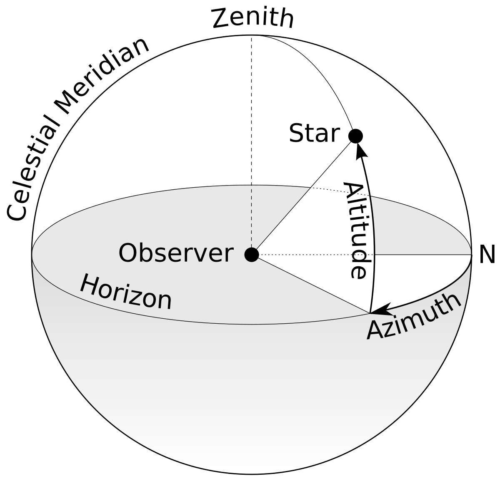{width=30%}

[Azimuth and Altitude](https://en.wikipedia.org/wiki/Horizontal_coordinate_system)

```{r, fig.width=5}
library(oce)
# lon <- 161.7673
# lat <- -77.45706

e <- c(162.5156, 162.7434, -77.51565, -77.46616)
# sl <- raster(paste0(dempath, "30m_slopeMDV.tif"))
# slwgs <- projectRaster(sl, crs=wgsproj)
# writeRaster(slwgs, "slpe_tmpl_latlon.tif")

slwgs <- raster("slpe_tmpl_latlon.tif")
slwgss <- crop(slwgs, e)
#mapview(slwgss, map.types="Esri.WorldImagery")

crds <- coordinates(slwgss)
crds <- data.frame(crds)
names(crds) <- c("lon", "lat")

loncrds <- mean(crds$lon)
latcrds <- mean(crds$lat)

# as <- raster("/scratch/tmp/llezamav/slopeaspect/30m_aspectMDV.tif")
# slrad <-  raster("/scratch/tmp/llezamav/slopeaspect/30m_radians_slopeMDV.tif")
# asrad <-  raster("/scratch/tmp/llezamav/slopeaspect/30m_radians_aspectMDV.tif")

#time should be in UTC
sa <- sunAngle(tdcomp_sel$mdate, lon=loncrds, lat=latcrds)

par(mfrow=c(1,2))
boxplot(sa$altitude, main="altitude mean loc")
boxplot(sa$azimuth, main="azimuth mean loc")

altmin <- min(sa$altitude)
altmax <- max(sa$altitude)
azmin <- min(sa$azimuth)
azmax <- max(sa$azimuth)
```

Now for each pixel location
```{r, fig.width=5}
sa <- lapply(seq(nrow(crds)), function(i){
  sai <- sunAngle(tdcomp_sel$mdate, lon=crds$lon[i], lat=crds$lat[i])
  list(sai$altitude, sai$azimuth)
})

alt <- unlist(lapply(sa, '[[', 1))
az <- unlist(lapply(sa, '[[', 2))

par(mfrow=c(1,2))
boxplot(alt, main="altitude all loc", ylim=c(-15,11))
boxplot(az, main="azimuth all loc",ylim=c(155,180))
```


#### Testing solar positions throughout a day and the year
One day in January ("2019-01-02 00:00:00 UTC" "2019-01-02 01:00:00 UTC" ....  "2019-01-02 23:00:00 UTC")
```{r, fig.width=5}
# one day beginning of january
library(lubridate)

hourly_20190102 <- ymd_hms("2019-01-02 00:00:00") + hours(0:24)
sa_hourly_20190102 <- sunAngle(hourly_20190102, lon=loncrds, lat=latcrds)
par(mfrow=c(1,2))
boxplot(sa_hourly_20190102$altitude, main="hourly altitude Jan")
boxplot(sa_hourly_20190102$azimuth, main="hourly azimuth Jan")

hourly_20190302 <- ymd_hms("2019-03-02 00:00:00") + hours(0:24)
sa_hourly_20190302 <- sunAngle(hourly_20190302, lon=loncrds, lat=latcrds)
par(mfrow=c(1,2))
boxplot(sa_hourly_20190302$altitude, main="hourly altitude March")
boxplot(sa_hourly_20190302$azimuth, main="hourly azimuth March")
```

During the year at the same time of day ("2019-01-01 14:00:00 UTC", "2019-01-02 14:00:00 UTC", ... "2019-12-31 14:00:00 UTC" )

```{r, fig.width=5}

dayly2019 <- ymd_hms("2019-01-01 14:00:00") + days(0:365)
sa_dayly2019 <- sunAngle(dayly2019, lon=loncrds, lat=latcrds)

altazdf <- data.frame(sa_dayly2019$altitude, sa_dayly2019$azimuth)
names(altazdf) <- c("altitude", "azimuth")
altazdf <- altazdf[altazdf$altitude>0,]

par(mfrow=c(1,2))
boxplot(altazdf$altitude, main="hourly altitude full year")
boxplot(altazdf$azimuth, main="hourly azimuth full year")


```

--> there is not enough azimuth change throughout a full year at the same time of day as to justify that the model was able to learn all sun positions from this, but we can argue that there are many more or less shaded pixels available in the research area, so that we can still expect the model to be able to pick up all it needs.  

#### Overview of all available scenes
```{r}
csvfiles_stacks <- list.files(L8datpath, recursive = T, pattern="timediff_comp_comp.csv", full.names = T)

comp_stacks <- lapply(seq(csvfiles_stacks), function(j){
  read.csv2(csvfiles_stacks[j])
})

allscenesinstacks <- do.call("rbind", comp_stacks)
nrow(allscenesinstacks)
```


# 4 make satellite data stacks
As I copied only those Landsat 8 scenes that were matching after the new match, some scenes may be in timediff_df that are not actually in the directories.

In each L8scenepath where data is available, there is a file called "timediff_df_stacks.csv", which contains the scenes that are within the satellite datastacks. 

```{r,eval=F}
file.edit("4_make_sat_stack.R")
```


```{r,eval=F}
source("4_make_sat_stack.R")
for(y in seq(year)){
  #for(y in c(5:7)){
  for(m in seq(month)){
  #for(m in c(5:8)){
    print(c(y,m))
    rasterOptions(tmpdir="D:/downscaling_after_talk/clean_data/run/")
    make_L8_MOD_stack(y,m,timethres)
    gc()
    file.remove(list.files("D:/downscaling_after_talk/clean_data/run/", 
                           full.names = T))
  }
#}
  
}


```

This outputs Landsat and Modis stacked together as "L_MOD2019-01.tif"  into the cddir directory together with a .csv file with the satnames "satnames_2019-01.csv". All 68 scenes from the query were actually downloaded and used. 


```{r}
satnamfiles <-list.files(paste0(cddir, "satstacks"), pattern="satnames", full.names = T)
satnamfileslist <- lapply(seq(satnamfiles), function(i){
  read.csv2(satnamfiles[i])
})

sn <- unlist(satnamfileslist)
#table(grepl("LC08",sn))

satfiles <-list.files(paste0(cddir, "satstacks"), pattern="L_MOD2", full.names = F)

sf_d <- substring(satfiles, 6,12)
#length(sf_d)
sf_dates <- paste0(sf_d, "-01 12:00:00")
sf_dates <- as.Date(sf_dates)

MODL8scenes <- sapply(seq(satnamfileslist), function(i){
  sum(grepl("LC08",satnamfileslist[[i]]$x)) # sum for counting true values
})

datescene_df <- data.frame(sf_dates, MODL8scenes)

ggplot(datescene_df, aes(sf_dates, MODL8scenes))+
  geom_point(shape = 15, size=3, color="olivedrab3")+
  ylab("amount of scenes")+xlab("")+
  scale_y_continuous(breaks=seq(1,12,by=2))+
  scale_x_date(date_labels = "%Y %m",date_breaks = "6 month")+
  theme(axis.text.y = element_text(size = 11),
        axis.text.x = element_text(size=11, angle=90,face="bold"))+
  ggtitle("Amount of matched Landsat and Modis scenes per month")

```

```{r, eval=F}
sf_fullnam <-list.files(paste0(cddir, "satstacks"), pattern="L_MOD", full.names = T)

# satstacks and naes
sat <- stack(sf_fullnam[grepl("2014-11", sf_fullnam)])
satnames <- read.csv2(list.files(paste0(cddir, "satstacks"), pattern="satnames_2014-11", full.names = T))
names(sat) <- satnames$x


```

```{r, eval=F}
# Summarize all _comp_comp files for hs and ia generation in a folder in clean data dir. 

dir.create(paste0(cddir, "comp_comp_files"))

ccfiles <- list.files(L8datpath, recursive=T, pattern="comp_comp", full.names = T)
ccfileendname <- substring(ccfiles, 59,nchar(ccfiles))
ccfe <- gsub("/", "_", ccfileendname)
ccto <- paste0(cddir, "comp_comp_files/", basename(ccfe))

file.copy(ccfiles, ccto)
```


```{r, eval=F}

# making a modis date rds 
ccf <- list.files(paste0(cddir, "comp_comp_files"), full.names = T)

ccfl <- lapply(seq(ccf), function(i){
  read.csv2(ccf[i])
})

cc <- do.call("rbind", ccfl)

moddate <- as.POSIXct(substring(cc$modscene, 11,22), format="%Y%j_%H%M", tz="UTC")
saveRDS(moddate, paste0(cddir, "moddates.RDS") )

```

# 5 make solar insolation tifs
This will be done on Palma with "5_ia_hs_Palma.R"
```{r}
source("5_ia_hs_loc.R")
# file.edit("5_ia_hs_loc.R")
moddates <- readRDS(paste0(cddir, "moddates.RDS"))
uniqueMODscenes <- unique(moddates)

# sl <- raster(list.files(dempath, pattern="30m_slopeMDV.tif", full.names=T))
# as <- raster(list.files(dempath, pattern="30m_aspectMDV.tif", full.names=T))
# 
# slrad <- raster(list.files(dempath, pattern="30m_radians_slopeMDV.tif", full.names=T))
# asrad <- raster(list.files(dempath, pattern="30m_radians_slopeMDV.tif", full.names=T))

lon <- 161.7673
lat <- -77.45706

# make_hs_ia(uniqueMODscenes[i])


```

#### make graphic sun location and small extent of ia and hs 
The sun angle: altitude, in degrees above the horizon, ranging from -90 to 90 and azimuth, in degrees eastward of north, from 0 to 360 is picked up by hillShading and incidence angle 

```{r}
iahsrespath <-  paste0(cddir, "ia_hs_res/")
iahs <- stack(list.files(iahsrespath, pattern="2018-11-12_13_50", full.names=T))

e <- c(381834.5, 400672.3, -1300278, -1284383)
iahs_s <- crop(iahs,e)

names(iahs_s) <- c("ia", "hs")

comp <- read.csv2(list.files(paste0(cddir, "comp_comp_files/"), pattern="2018-11", full.names=T))

scenesday <- comp[grepl("2018/11/12", comp$moddate),]
scenesday <- scenesday[grep("_1350_", scenesday$modscene),]

sa <- read.csv2(list.files(paste0(iahsrespath, "sa/"), pattern="2018-11-12_13_50", full.names = T))


# sa$azimuth
# sa$altitude

filesNov18 <- list.files(paste0(cddir, "satstacks_ngb/"), pattern="ia_hs_2018-11", full.names = T)
namnov18 <- read.csv2(filesNov18)

filenov18 <- list.files(paste0(cddir, "satstacks_ngb/"), pattern="L_MOD_hs_ia_2018-11.tif", full.names = T)
satnov18 <- stack(filenov18)


names(satnov18) <- namnov18$x

matchmod <- satnov18[[grep("A2018316.1350",names(satnov18))[1]]]
matchL <- satnov18[[grep("LC08_L1GT_225128_20181112_20181127",names(satnov18))[1]]]
matchsat <- stack(matchmod, matchL)
names(matchsat) <- c("MOD", "L")

matchsatc <- crop(matchsat, e)

pal = function (n, alpha = 1, begin = 0, end = 1, direction) {
    viridis(n, alpha, begin, end, direction=-1, option = "inferno")
}
```

To compare MODIS, Landsat LST with incidence angle and hillshading - this is what is finally used - the ngb resampling of MODIS to 30m to maintain the original pixel info. 

```{r}
mapview(iahs_s$ia, map.types="Esri.WorldImagery", na.color="#00000000")+mapview(iahs_s$hs, col.regions = pal, na.color="#00000000")+
  mapview(matchsatc$MOD, na.color="#00000000")+
  mapview(matchsatc$L, na.color="#00000000")

# par(mfrow=c(1,2))
# plot(iahs_s$hs, col=rev(pal(100)))
# plot(matchsatc$L,col=pal(100))

filesNov18_bilinres <- list.files(paste0(cddir, "satstacks/"), pattern="2018-11", full.names = T)
satnov18_bilinres <- stack(filesNov18_bilinres[1])


neednam <- rep(c(TRUE, TRUE, FALSE, FALSE), ( nlayers(satnov18_bilinres) / 4))

names(satnov18_bilinres)<- namnov18$x[neednam]


matchmod_bilin <- satnov18_bilinres[[grep("A2018316.1350",names(satnov18_bilinres))[1]]]
matchL_bilin <- satnov18_bilinres[[grep("LC08_L1GT_225128_20181112_20181127",names(satnov18_bilinres))[1]]]
matchsat_bilin <- stack(matchmod_bilin, matchL_bilin)
names(matchsat_bilin) <- c("MOD", "L")


matchsat_bilinc <- crop(matchsat_bilin, e)
```

Compare bilinearly resampled and ngb resampled MODIS

```{r}
mapview(iahs_s$ia, map.types="Esri.WorldImagery", na.color="#00000000")+mapview(iahs_s$hs, col.regions = pal, na.color="#00000000")+
  mapview(matchsat_bilinc$MOD, na.color="#00000000")+
  mapview(matchsat_bilinc$L, na.color="#00000000")
```

Checking for differences in bilinear and ngb resampling of MODIS
```{r}
mapview(matchsat_bilinc$MOD, na.color="#00000000")+mapview(matchsatc$MOD, na.color="#00000000")
```
Let's stick with the ngb resampling - looks better 

```{r}
files <- list.files(paste0(cddir, "satstacks_ngb/"), pattern="2019-01", full.names = T)
sat1901 <- stack(files[1])

```

#### the sun's position in this scene
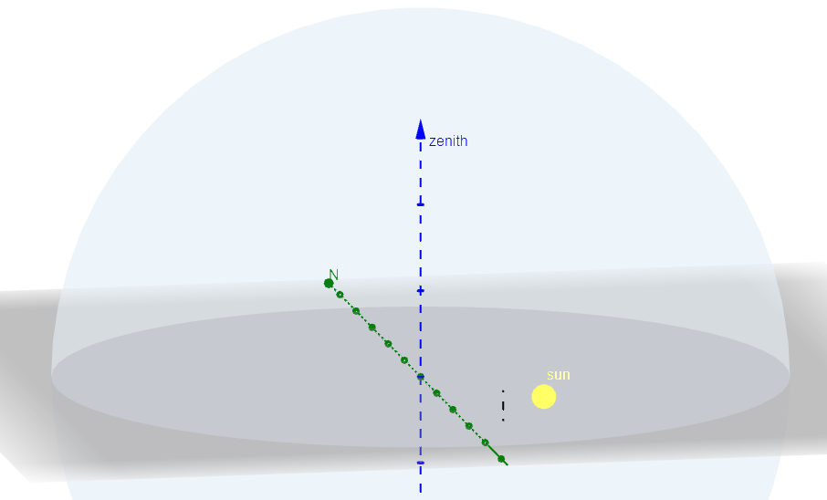


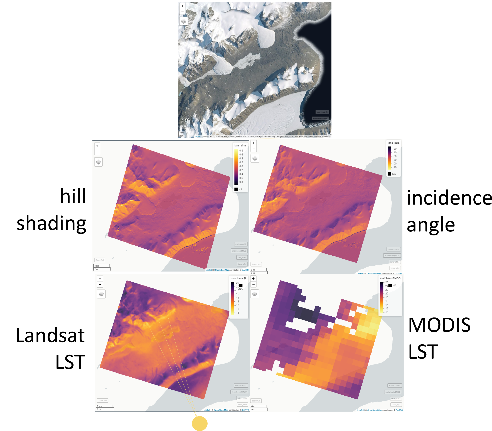

```{r}

hours <- as.character(seq(1,23))
hours <- sapply(seq(hours), function(i){
  if(nchar(hours[i])<2){
    hours[i] <- paste0("0", hours[i])
  }
  hours[i]
})

uniquescenes <- as.POSIXct(paste0("2013-11-12 ", hours, ":00:00"), tz="UTC")
  
tNZ <- with_tz(uniquescenes, tzone="Pacific/Auckland")

f_ia_hs_dayex <- list.files(paste0(cddir, "ia_hs_dayex/"), full.names = T, pattern=".tif")

ia_hs_dayex <- lapply(seq(f_ia_hs_dayex), function(i){ stack(f_ia_hs_dayex[i])})
hs_dayex <- lapply(ia_hs_dayex, '[[', 2)
ia_dayex <- lapply(ia_hs_dayex, '[[', 1)

hs_dayex <- stack(hs_dayex)
ia_dayex <- stack(ia_dayex)
names(hs_dayex) <- paste0("p",seq(1,nlayers(hs_dayex)),
                          "hU",substring(names(hs_dayex),22,23), "hNZ", hour(tNZ), 
                          gsub("_", "", substring(names(hs_dayex),27,39)))

hs_dayexsubs <- hs_dayex[[seq(1,23,by=3)]]
hs_dayexsubs <- crop(hs_dayexsubs, e)

# animate(hs_dayexsubs, main=names(hs_dayexsubs), col = gray.colors(20, start = 0.3, end = 0.9, gamma = 2.2, alpha = NULL), n=1, pause=0.3)

spplot(hs_dayexsubs, col.regions=gray.colors(20, gamma=0.5))

```

Plot naming: p1 = plot 1, U01 = UTC hour 01, hNZ14 = 2pm NZ, az359 = azimuth 359° degrees from north over east, al30 = altitude (sun elevation angle) 30°. 
Those plots are south oriented, i.e. north is located to the center of the lower plotlength. 

The hillshading color scale needs to be inversed so that it makes sense visually. 

We've got 15 months
```{r}
# train and test months graphic
```

# 6 stack satellite and hs, ia images
```{r, eval=F}

#file.edit("6_match_MOD_L_ia_hs.R")
source("6_match_MOD_L_ia_hs.R")

# # ia hs res 
# iahsrespath <- paste0(cddir, "ia_hs_res")
# list.files(iahsrespath, pattern=".tif")
# 
# # satstacks
# list.files(paste0(cddir, "satstacks_ngb"))
# 
# # info files
# list.files(paste0(cddir, "comp_comp_files"))


yearmonthsatpaths <- list.files(paste0(cddir, "satstacks_ngb"), pattern=".tif", full.names = T)

for(i in seq(length(yearmonthsatpaths))){
  print(basename(yearmonthsatpaths[i]))
  match_sat_ia_hs(yearmonthsatpaths[i])
}
```

making 1000m satstacks by resampling the 30m ones
```{r}

temp1000m <- raster(paste0(modispath, "2018-11/LST/proj_c_warp_LST_MYD11_L2.A2018323.1355.006.2018337213536.tif"))
stacks30 <- list.files(paste0(cddir, "satstacks_ngb"), pattern="L_MOD_hs_ia_", full.names = T)

```

Compare_L_M pngs of satellite stacks Landsat and MODIS 30m for all stacks, written into "compare_L_M" folder in cddir. 
```{r, eval=F}
lapply(seq(stacks30), function(i){
    ym <- substring(basename(stacks30[i]), 13,19)
    ymf <- list.files(paste0(cddir, "satstacks_ngb"), pattern=ym, full.names = T)
    satnames <- read.csv2(ymf[grepl("names_sat_ia_hs", ymf)])
    
    st30 <- stack(stacks30[i])
    names(st30) <- satnames$x

    # get always MOD and L (1 and 2 of a pack of 4), crop the (?) and plot them on the same scale side by side and write to a folder to compare visually 
    scenebatches <- nlayers(st30)/4
    scenebatchend <- seq(scenebatches)*4
    scenebatchstart <- scenebatchend-3
    
    s <- sort(c(scenebatchstart, scenebatchstart+1))
    
    for(j in seq(length(scenebatchstart))){
        print(c(i,j))
      
        LM30 <- st30[[scenebatchstart[j]:(scenebatchstart[j]+1)]]
          
          
        nam <- paste0("L_", substring(names(LM30)[1], 11,25), 
             "__", "M_", substring(names(LM30)[2], 11,22))
            
            
        png(paste0(cddir, "compare_L_M/", nam, "_", j,".png"),
          width=1200, height=1000)
    
        p <- spplot(LM30)
        print(p)
        dev.off()
    }
})
```

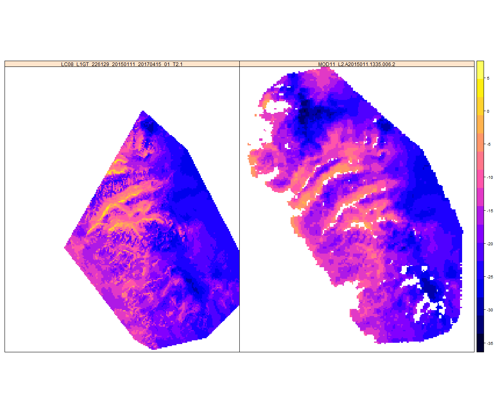


```{r, eval=F}


# Slideview for the same scene: 


library(slideview)

# * 226129_20141210 1335
# 
# * 226128_20141108 1335
# pat <- c("226129_20150111", "226129_20141210", "226128_20141108")

stacks30 <- list.files(paste0(cddir, "satstacks_ngb"), pattern="L_MOD_hs_ia_", full.names = T)
selstacks30 <- stacks30[grepl("2015-01",stacks30)]
pat <- "226129_20150111"

# 
# lapply(seq(selstacks30), function(i){
    #ym <- substring(basename(selstacks30[i]), 13,19)

    ym <- substring(basename(selstacks30), 13,19)
    ymf <- list.files(paste0(cddir, "satstacks_ngb"), pattern=ym, full.names = T)
    satnames <- read.csv2(ymf[grepl("names_sat_ia_hs", ymf)])
    
    #st30 <- stack(selstacks30[i])
    st30 <- stack(selstacks30)
    names(st30) <- satnames$x
    
    
    
    scenebatches <- nlayers(st30)/4
    scenebatchend <- seq(scenebatches)*4
    scenebatchstart <- scenebatchend-3
    
    s <- sort(c(scenebatchstart, scenebatchstart+1))
    
    Landsloc <- unlist(sapply(seq(pat), function(x){
          which(grepl(pat[x],names(st30)))
    }))
    
    usesceneloc <- Landsloc[grepl("1335", names(st30)[Landsloc+1])]

    LMstack <- st30[[usesceneloc[1]:(usesceneloc[1]+1)]]
    slideView(LMstack[[1]], LMstack[[2]],
              label1 = "Landsat", label2 = "Modis",
              maxpixels =  150000)

    
```

#### making MODIS / Landsat plots for small extents to check whether there is mismatch in the patterns of LST
```{r, eval=F}
f1000 <- list.files(paste0(cddir, "satstacks_1000m/"), full.names = T)


stacks1000 <- lapply(seq(f1000), function(i){
    x <- stack(f1000[i])

    ym <- substring(basename(f1000[i]), 13,19)
    ymf <- list.files(paste0(cddir, "satstacks_ngb"), pattern=ym, full.names = T)
    satnames <- read.csv2(ymf[grepl("names_sat_ia_hs", ymf)])
    
    names(x) <- satnames$x
    x
    
    #### TO DO xxxxxxxxxxxxxxxxxxxx ########
    # get always MOD and L (1 and 2 of a pack of 4), crop the (?) and plot them on the same scale side by side and write to a folder to compare visually 
    scenebatches <- nlayers(x)/4
    scenebatchend <- seq(scenebatches)*4
    scenebatchstart <- scenebatchend-3
    
    s <- sort(c(scenebatchstart, scenebatchstart+1))
    
    for(j in seq(length(scenebatchstart))){
        print(c(i,j))
      
        LM1000 <- x[[scenebatchstart[j]:(scenebatchstart[j]+1)]]
          
          
        nam <- paste0("L_", substring(names(LM1000)[1], 11,25), 
             "__", "M_", substring(names(LM1000)[2], 11,22))
            
            
        png(paste0(cddir, "compare_L_M/LM1000_", nam, "_", j,".png"),
          width=1200, height=1000)
    
        p <- spplot(LM1000)
        print(p)
        dev.off()
    }
})   

```


#### Crop to intersection before extraction? 
Will that be faster for the extraction process? 


# 7 Extraction on Palma
Every value over 30°C and under -100°C is set NA - that should happen with all prediction data sets as well, then. 

```{r}
# file.edit("7_stack_extraction_Palma.R")
```

# 8 prep train and test datasets

##### train and test
**Spatial**
There are 65 blocks of dimension 20000x20000m, i.e. 20km². I will select 60% for training and 40% for testing, which means 25 blocks for testing. The test and train blocks are sampled randomly. 
```{r,eval=F}
blockmask <- raster(paste0(dempath, "blockmask_aoi.tif"))
mapview(blockmask, na.color="#00000000",map.types="Esri.WorldImagery")

blockunique <- unique(blockmask[])
blocktestn <- length(blockunique)*0.4

blocktestsample <- sample(blockunique, size=blocktestn, replace=F)
blocktestsample <- blocktestsample[!is.na(blocktestsample)]
write.csv2(blocktestsample, paste0(cddir, "blocktest_samples_test.csv"))
testblock <- blockmask
testblock[testblock %in% blocktestsample & !is.na(testblock)] <- 200
testblock[testblock !=200 & !is.na(testblock)] <- 0

tbt <- table(testblock[])

writeRaster(testblock, paste0(dempath, "updated_spatial_test_blocks.tif"), overwrite=T)

```


```{r}
testblock <- raster(paste0(dempath, "updated_spatial_test_blocks.tif"))
mapview(testblock, na.color="#00000000",map.types="Esri.WorldImagery",
        alpha.regions=0.3)


```

Make Train and Test Polygons for graphic
```{r, eval=F}
library(stars)
x <- st_as_stars(testblock) %>% 
  st_as_sf(merge = TRUE) 
mapview(x)

write_sf(x, paste0(cddir, "train_test_polygons.shp"))
# %>% # this is the raster to polygons part
#   st_cast("MULTILINESTRING") # cast the polygons to polylines

test <- x[x$updated_spatial_test_blocks == 200,]
train <- x[x$updated_spatial_test_blocks == 0,]

mapview(test)+mapview(train)

st_as_sf(test)
writeOGR(test, paste0(cddir, "train_test_polygons.shp"), driver="ESRI Shapefile")

#file.edit("../paper_map.R")

```

```{r}
test_shapes <- readOGR(paste0(cddir, "train_test_polygons.shp"))
names(test_shapes) <- "tt"
test_shapes$ttw <- NA
test_shapes$ttw[test_shapes$tt == 200] <- "test"
test_shapes$ttw[test_shapes$tt == 0] <- "training"


pal = mapviewPalette("mapviewRasterColors")

pal <- function (n, alpha = 1, begin = 0, end = 1, direction = 1) {
    viridis(n, alpha, begin, end, direction, option = "viridis")
}


pal <- function(n, alpha, start, end, gamma){
  gray.colors(n, start=0, end = 1, gamma = 1.9, alpha, rev = FALSE)

}


trainex <- stack(stacks30[1])
testex <- stack(stacks30[3])

mapview(trainex[[2]], col.regions=pal,na.color="#00000000")+
  mapview(test_shapes[test_shapes$ttw=="training",], 
          na.color="#00000000", col.regions='chartreuse3',
          alpha.regions=0.3)


mapview(testex[[2]], col.regions=pal,na.color="#00000000")+
  mapview(test_shapes[test_shapes$ttw=="test",], 
          na.color="#00000000", col.regions="#1b1ff5",
          alpha.regions=0.3)

```

**Temporal**
I take roughly 60% of the data for training and 40% for testing (6 of 15 months for time blocking). For testing I take two January scenes and one scene each from November and December, as these months are covered by 4 years each. Also, I take the only march dataset to take a look at the performance outside of the  summer months this model was mostly trained on and one of the february scenes. 

```{r}
library(plyr)
(avyearmonths <- substring(list.files(paste0(cddir, "satstacks_ngb/"), pattern="L_MOD_hs_ia"),
                    13,19))
avdates <- as.Date(paste0(avyearmonths, "-01"))

avym <- data.frame(date=avdates, y=year(avdates), m=month(avdates))
pos <- match(avym$date,datescene_df$sf_dates)
avym$nscenes <- datescene_df$MODL8scenes[pos]
sum(avym$nscenes )

print(paste0(sum(avym$nscenes[avym$m==1]), " scenes from January"))
print(paste0(sum(avym$nscenes[avym$m==12]), " scenes from December"))
print(paste0(sum(avym$nscenes[avym$m==11]), " scenes from November"))

avym$test <- 0
avym$test[avym$m==1 & avym$y==2015] <- 1
avym$test[avym$m==2 & avym$y==2017] <- 1
avym$test[avym$m==3 & avym$y==2019] <- 1
avym$test[avym$m==11 & avym$y==2014] <- 1
avym$test[avym$m==12 & avym$y==2018] <- 1
avym$test <- as.factor(avym$test)

# write.csv2(avym, paste0(cddir, "available_months_scenes_test.csv"))

avym$mtext <-factor( month(avym$date, abbr=T, label=T), ordered=F)
avym$mtext <- revalue(avym$mtext, c("Mrz"="Mar", "Dez"="Dec"))

avym$mtext <- ordered(avym$mtext, levels=c("Nov", "Dec","Jan", "Feb", "Mar"))


my_breaks <- c(1,2,3,4,6,9,12)

png(paste0(figurepath, "new/scenes_test.png"),
    units="in", width=8, height=5, res=300)
        
ggplot(avym, aes(x=y, y=mtext, group=test, color=nscenes))+
  geom_point(aes(shape=test),size=5)+ 
  scale_y_discrete()+
  scale_shape_manual(values=c(16,17),
                     labels=c("training","test"),
                     name="")+
  theme_minimal()+labs(group = " ", color="n scenes")+
  scale_color_viridis_c(option = "viridis",trans="log",
                        breaks = my_breaks, labels = my_breaks)+
  ylab("")+xlab("")+
  scale_x_continuous(breaks=unique(avym$y))+
  theme(legend.title = element_text("n scenes", size = 12),
        legend.text = element_text(size=10),
        axis.text.x = element_text(size=12),
        axis.text.y = element_text(size=12),
        #panel.grid.minor  = element_blank(),
        panel.grid.major  = element_blank())
# +
#   ggtitle("Available scenes and time block external testing",
#                           subtitle = "Test months as triangles")

dev.off()


print(paste0(sum(avym$nscenes[avym$test==0]), " scenes for training"))
print(paste0(sum(avym$nscenes[avym$test==1]), " scenes for testing"))

print(paste0(round(
  sum(avym$nscenes[avym$test==1])/68, digits = 2),
             " percent of scenes for temporal testing"))
```

```{r}
#file.edit("../paper_map.R")
```


Choosing of training samples by the Dissimilarity Index is performed only for the months that are taken into the training. 

```{r}
# file.edit("Palma/8_DI_log_choosing_Palma_3m.R")
# file.edit("Palma/8a_gather_train_test.R)

```


Make 3 types of test datasets from what comes out of 8_DI_log_choosing_Palma_3m:  

* 1 validation areas of all months

Test areas for all months as "test_all_samples_....csv".

* 2 training areas from validation months

Take "train_DI_2015-01.csv" for the 5 validation months, i.e.  "2014-11", "2015-01", "2017-02", "2018-12" and "2019-03" 

* 3 validation areas from validation months

Take "test_all_samples_....csv" from  "2014-11", "2015-01", "2017-02", "2018-12" and "2019-03" 

```{r}
#file.edit("train_tests_LST_pred_fig.R")
```

##### 8b scale metric and make dummys

Min and Max values for the scaled predictor variables.
```{r}
# file.edit("8b_scale_metric_add_dummys.R")

trainvalidpath <- paste0(cddir, "train_valid/")

train <- read.csv2(paste0(trainvalidpath, "train_LHS_150000.csv"))
(mmv <- readRDS("add_files/overall_minmaxvals_train_valid.Rds"))

sort(table(train$soilraster))

```

\begin{table}[]
\begin{tabular}{ll}
1  & Gat+Gao         \\
3  & Ght+Gho         \\
4  & Ice             \\
5  & Lat+Lao         \\
7  & Lat+Tat+Lao+Tao \\
9  & Lht+Lho         \\
10 & Lht+tht+lho+tho \\
12 & Snow            \\
13 & Tao             \\
19 & Tat+Ght         \\
20 & Tat+Lat         \\
21 & Tat+Tao         \\
24 & Tht+tho        
\end{tabular}
\end{table}

I'm leaving 12 (Snow) out as the reference category for the soilraster. 
For landcover the same, snow and ice goes out, that is XXX in this 1 and 2 code system. 
For MOD MYD I'm using Terra (MOD) as reference, MYD will be in the model. 

Thus *in the model goes*: TeAqNum.2 (MYD),  landcoverres.1 (for soil), and soilraster.1, .4, .5, .7, .9, .10, .13, .20, .21, .24

*Reference categories* are: TeAqNum.1 (MOD),  landcoverres.2 (for snow and ice), and soilraster.12


```{r}
trainvalidpath <- "D:/downscaling_after_talk/clean_data/train_valid/"

train <- read.csv2(paste0(trainvalidpath, "train_LHS_150000.csv"))

test1 <- read.csv2(paste0(trainvalidpath, "validation_1_LHS_150000.csv"))
test2 <- read.csv2(paste0(trainvalidpath, "validation_2_LHS_150000.csv"))
test3 <- read.csv2(paste0(trainvalidpath, "validation_3_LHS_150000.csv"))


head(train)
head(test3)
```


# 9 run all algorithms FFS
## First run through 

```{r}
#file.edit("Palma/9_FFS_models.R")
```

## Second run through 

Trying out SE=FALSE, more trees and leaving out slope only for RF.
```{r}
#file.edit("Palma/9_FFS_remodelling_rf.R")
```

## Third run through 

After scaling to the margins of train and all validation sets, from 0 to 1 and implementing dummys in the way described above. Running separately to make it quicker and not having to parallelize. 
```{r}
#file.edit("Palma/9_FFS_models_rf_SE_F.R")
#file.edit("Palma/9_FFS_models_nnet_SE_F.R")
#file.edit("Palma/9_FFS_models_gbm_SE_F.R")
#file.edit("Palma/9_FFS_models_svmLinear_SE_F.R")

```


#### 9a run all algorithms FFS on 1000m - not in this run

# 10 evaluate FFS models 

## First run through 
```{r}
# file.edit("10_evaluate_FFS.R")

FFS_predictors <- readRDS("add_files/selected_predictors_FFS.Rds")
FFS_predictors

stats <- readRDS("add_files/stats_FFS.Rds")
stats
```

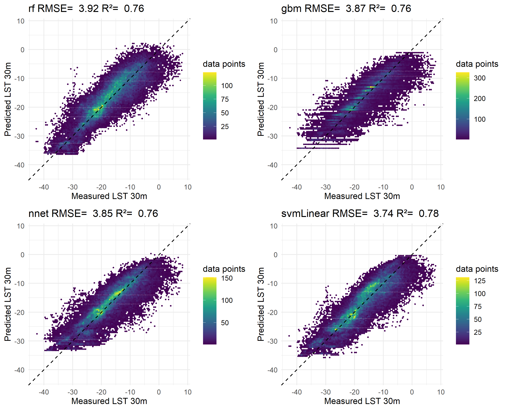
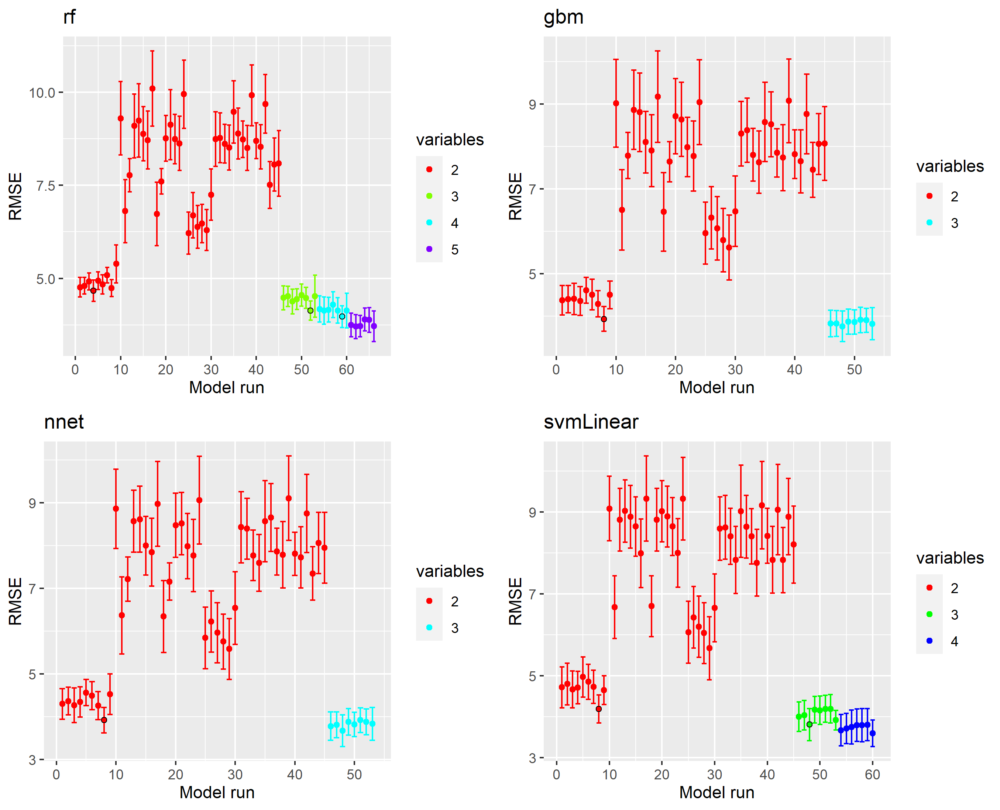
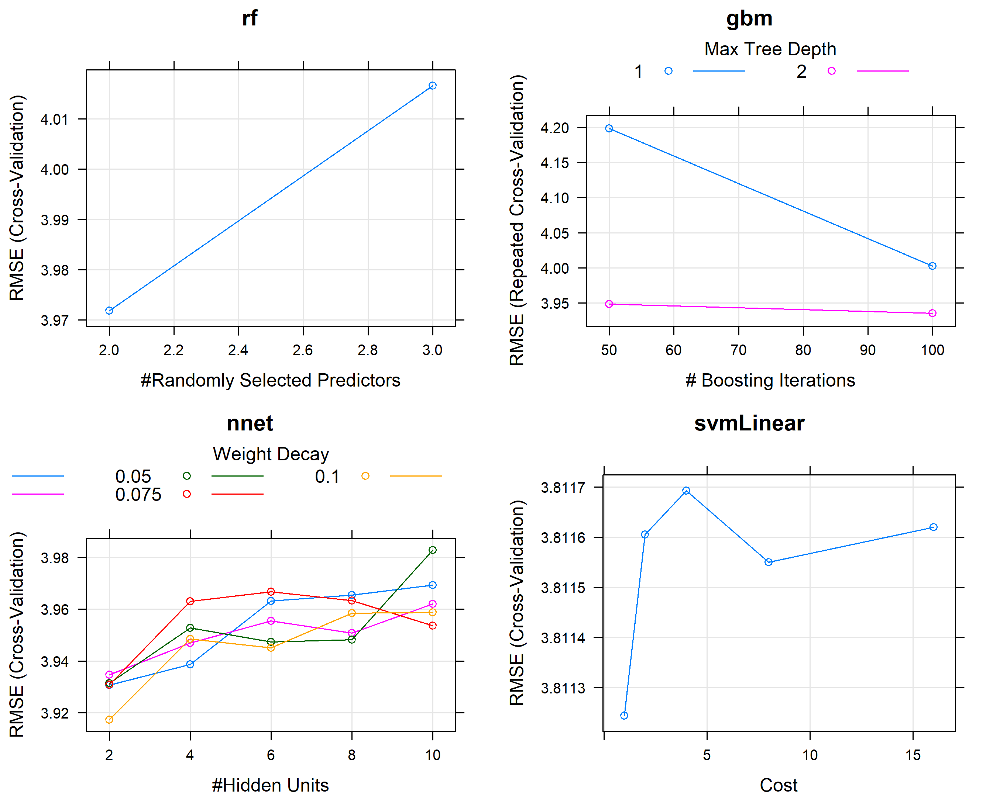


Checking whether slope and aspect could be interfering with ia and hs:
```{r}
tvdir <- paste0(cddir, "train_valid/")
train <- read.csv2(list.files(tvdir, pattern="train_LHS_150000.csv",full.names=T))


predictors <- train[,c("Modis","ia", "hs", "dem", 
                       "slope", "aspect", "TWI", 
                       "soilraster", "landcoverres")]

cm <- cor(predictors)
par(mfrow=c(1,1), mar= c(5, 4, 4, 2) + 0.1)
corrplot::corrplot(cm, method=c("number"), type="upper", diag=F,tl.col="black")
```

```{r, eval=F}
lmod <- lm(predictors$Modis~predictors$ia+predictors$hs+
     predictors$dem+predictors$slope+predictors$aspect+predictors$TWI+predictors$soilraster+predictors$landcoverres)

summary(lmod)

```

## Second run through (remodeling RF)

```{r}
# file.edit("10_evaluate_FFS_remodelling.R")

FFS_predictors_remod <- readRDS("add_files/selected_predictors_FFS_remodeling.Rds")
FFS_predictors_remod

stats_remod <- readRDS("add_files/stats_FFS_remodeling.Rds")
names(stats_remod) <- c("no slope", "SE=F")
stats_remod
```

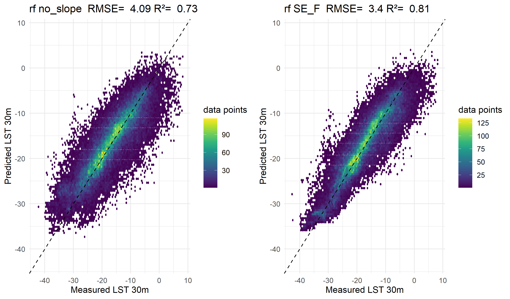

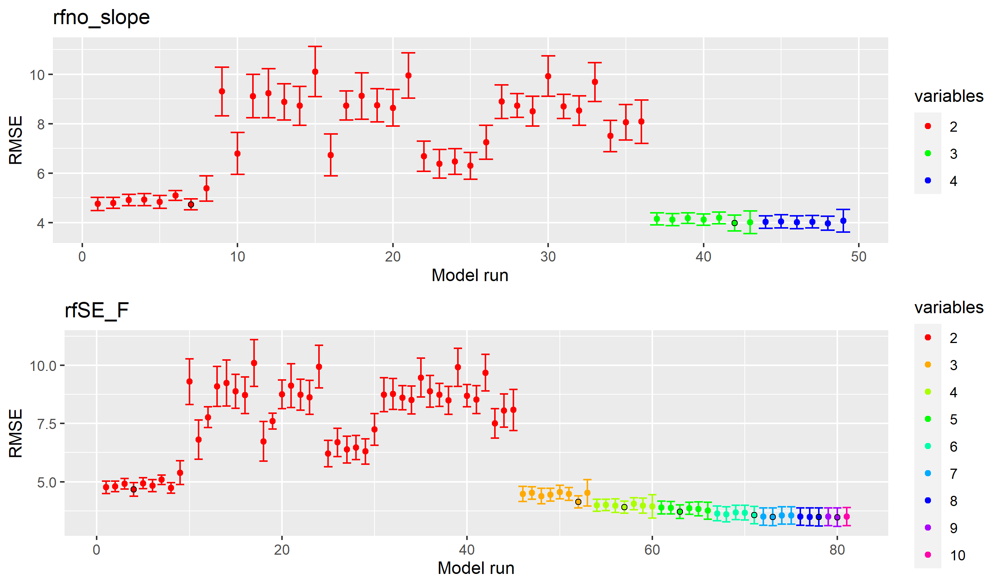

## Third run through (dummyrun all)

```{r}

# file.edit("10_evaluate_FFS_dummyrun.R")
readRDS(paste0("add_files/selected_predictors_FFS_dummyrun", "gbm", ".Rds"))
readRDS(paste0("add_files/stats_FFS_dummyrun", "gbm", ".Rds"))

readRDS(paste0("add_files/selected_predictors_FFS_dummyrun", "nnet", ".Rds"))
readRDS(paste0("add_files/stats_FFS_dummyrun", "nnet", ".Rds"))


```


# 11 tune final models 

**rf** tune mtry 2:length(selected predictors)

**nnet** 
When you train a neural network (nnet) using Caret you need to specify two hyper-parameters: size and decay. Size is the number of units in hidden layer (nnet fit a single hidden layer neural network) and decay is the regularization parameter to avoid over-fitting. 

tune size: 2:length(selected predictors), learning rate decay
Trying expand.grid(decay = c(0.5, 0.1, 1e-2, 1e-3, 1e-4, 1e-5, 1e-6, 1e-7),
                size = c(3, 5, 10, 20)) as recommended here https://stackoverflow.com/questions/42417948/how-to-use-size-and-decay-in-nnet 
                
**svmLinear** C controls how large the support vectors, i.e. margins are

**gbm** expand.grid(interaction.depth = seq(3,14,2), 
                             n.trees = c(100,200,300,400,500),
                             shrinkage = c(0.01,0.05,0.1),
                             n.minobsinnode = 10) 
     
     
```{r}
#file.edit("Palma/11_tune_final_models_dummyrun.R")

```


# 12 external testing
var imp & pred obs plots are generated for all algorithms and validation sets, 

```{r}
# file.edit("12_external_testing_dummyrun.R")
```

#### Second run through (remodeling RF)


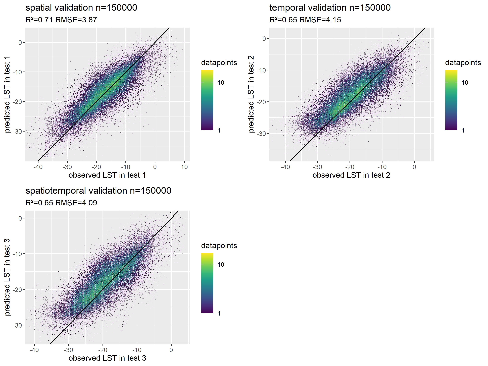

### RF

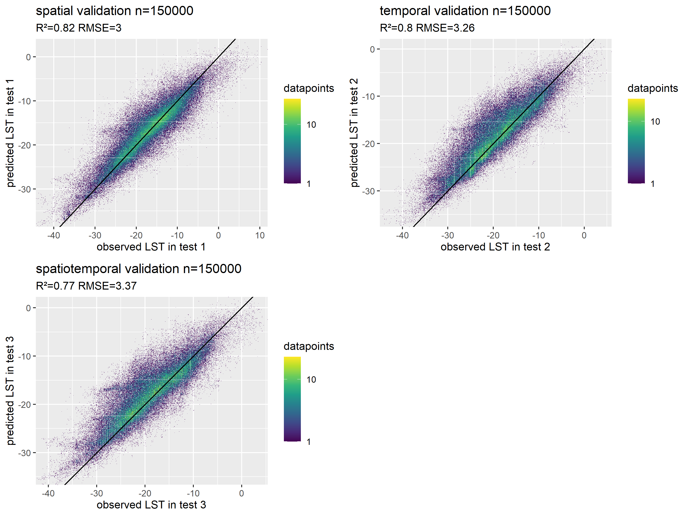


So it looks like it might be useful to have the setting to withinSE=F. 

#### Third run through (dummyrun all)

### GBM
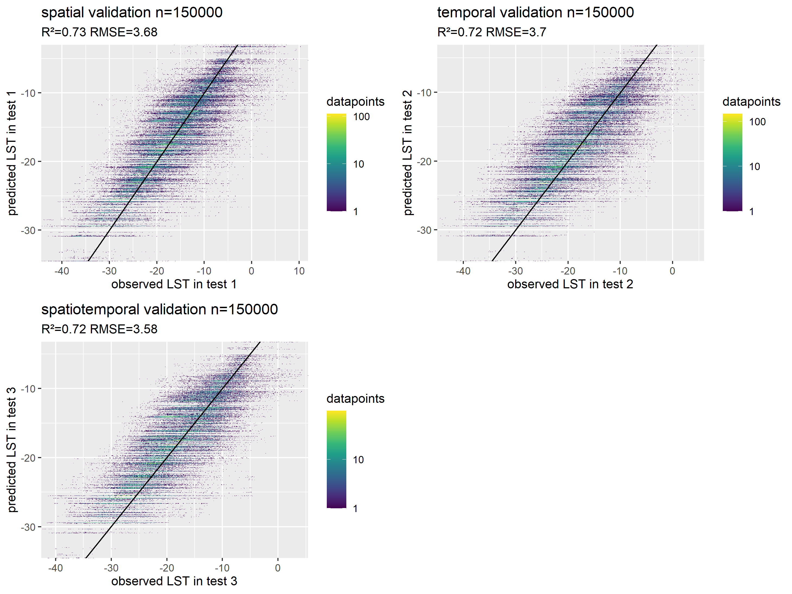

### NNET

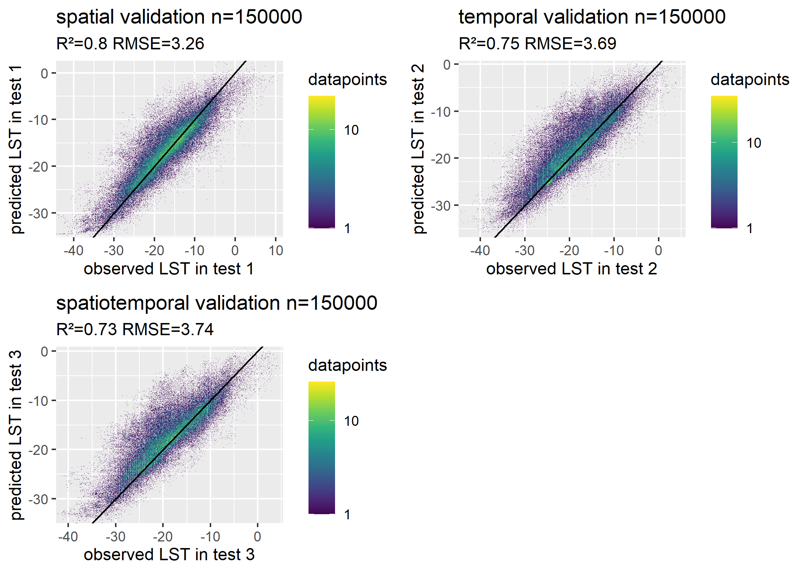


Random Forest is only slightly better than the neural net, gbm is out due to weird patterns in the external testing. 

# 13 make predictor stacks
```{r}

```

# 14 run AOA 

```{r, eval=F}
modelpath <- "D:/downscaling_after_talk/models/"
trainvalidpath <- "D:/downscaling_after_talk/clean_data/train_valid/"


test1_sc <- read.csv2(paste0(trainvalidpath, "validation_1_LHS_150000_scaled.csv"))
test2_sc <- read.csv2(paste0(trainvalidpath, "validation_2_LHS_150000_scaled.csv"))
test3_sc <- read.csv2(paste0(trainvalidpath, "validation_3_LHS_150000_scaled.csv"))


load(paste0(modelpath, "final_model_gbm_150000dummyrun.RData"))

# aoa_gbm <- aoa(newdata=test3_sc[1:10,], 
#     model=model_final)
```


```{r, eval=F}
#file.edit("Palma/14_AOA.R")
```


# 14 time series generation


# TO DO 
  
\newcommand{\boxedcheckmark}
  {{\ooalign{$\Box$\cr\hidewidth$\checkmark$\hidewidth}}}
  
$\checkmark$  band 10/11 reference (literature) 

$\checkmark$  MODIS: take a look at Error_LST: 0.2 to 1.8 - looks ok, not sure whether it helps to include that information, because L8 LST is also biased, but I don't get an error measurement there. Only thing could be to incorporate it in the extraction table and then see if training with only low error pixels will work better? 

$\checkmark$  use EMISSIVITY from modis product? Won't... doesn't look promising because patchy & resolution issue - assuming emissivity for the two contrasting land cover types at 30m resolution seems to be the more sensible option

$\checkmark$  use Aqua and Terra for training? Only Aqua, below 15min time difference available here 

$\checkmark$ training test areas 

$\checkmark$ SWIR raus 

- hs & ia predict function (neue MODIS scene, MODELL + hs / is Berechnung -> prediction)

$\checkmark$  hypercube vs. mein sampling

- run models with SE = TRUE (?)

- apply AOA to final raster

- 1000m training

- does Modis and Landsat coincide well or is there an issue in either timing or projecting of swath data? 

#### Open questions: 
- What does -1 in Landsat Land Cloud Cover mean? Missing value I assume 
- Is it problematic that we only get T2 datasets? 

